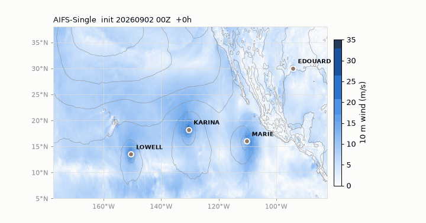

# scmp-5990 — running ECMWF AIFS-Single 2.0 locally

Runs ECMWF's open AI weather model on a laptop CPU (tested on Apple M5, 32 GB RAM).

## What's here

| Path | What |
|---|---|
| `model/` | Downloaded from Hugging Face `ecmwf/aifs-single-2.0`: weights (`.ckpt`, 948 MB), ECMWF's `inference.yaml`, land-sea mask `lsm.grib`. Not committed. |
| `run.yaml` | Copy of ECMWF's config with local paths, `device: cpu`, and a short `lead_time`. |
| `out/` | Forecast output (GRIB) and run logs. Not committed. |

## Setup

```bash
uv venv --python 3.12 .venv          # 3.14 is too new for these pins
uv pip install --python .venv/bin/python \
  "anemoi-inference[huggingface]==0.8.3" anemoi-models==0.9.3 anemoi-utils==0.4.35.post3 \
  torch==2.7.0 torch-geometric==2.6.1 \
  "anemoi-plugins-ecmwf-inference[opendata]==0.2.1" \
  earthkit-regrid==0.5.1 ecmwf-opendata==0.3.29 "earthkit-data<1"

.venv/bin/hf download ecmwf/aifs-single-2.0 \
  inference.yaml lsm.grib aifs-single-mse-2.0.ckpt --local-dir model
```

Versions are ECMWF's own pins from the model repo's `pyproject.toml`, minus `flash-attn`
(Linux + NVIDIA only). `anemoi-transform` resolves to ECMWF's `0.1.16.post2` backport.

## Run

```bash
.venv/bin/python run_aifs.py run.yaml
```

- `run_aifs.py` is `anemoi-inference run` plus three compatibility shims (see Gotchas). On Linux with an
  NVIDIA GPU and flash-attn installed, `anemoi-inference run run.yaml` works directly (shim 1 still applies).
- Initial conditions are fetched automatically from ECMWF Open Data (latest cycle and the one 6 h before).
- Output lands in `out/aifs_test.grib`. Change `lead_time` in `run.yaml` for longer forecasts (default 240 h).

## Measured (Apple M5, 32 GB, CPU only, 6 h forecast)

| | |
|---|---|
| Input download + regrid | ~2 min (first run also builds regrid weights) |
| Model load | 3 s |
| One 6 h step | 14 min 54 s, ~4 cores busy |
| Peak memory | 8.6 GB |
| Output | `out/aifs_test.grib`, 107 MB, 215 fields at steps 0 and 6 |

A 10-day forecast (40 steps) would take ~10 h at this rate. Fine for a test, not for routine use;
use a GPU for that.

## Plot

```bash
.venv/bin/python plot_aifs.py out/aifs_test.grib 2t 6     # -> out/2t_step6.png
```

## Gotchas

- **`KeyError: 'z'` at startup** (`anemoi-inference run run.yaml`). ECMWF pins `anemoi-transform==0.1.16.post2`
  because AIFS 2.0's config uses `apply-mask` with a `param:` option that exists only in that backport. But the
  Open Data input plugin (0.2.1) expects the attribute names `orography`/`geopotential` from anemoi-transform
  0.1.17+, while 0.1.16.post2 reads `orog`/`z`. ECMWF's notebook builds the input by hand and never touches
  the plugin, so they didn't hit it. Bumping anemoi-transform breaks `apply-mask` instead (`unexpected keyword
  argument 'param'`). `run_aifs.py` patches the plugin class to carry both spellings.
- **`ModuleNotFoundError: No module named 'flash_attn'` while loading the checkpoint.** The pickled model
  holds a reference to `flash_attn.flash_attn_interface.flash_attn_func`, so `torch.load` needs the module to
  exist even if it is never called. `run_aifs.py` registers a stub.
- **Attention memory on CPU.** anemoi-models 0.9.3 has an SDPA fallback, but it builds the full
  40320 x 40320 attention matrix per head (~100 GB). AIFS uses sliding-window attention (|i-j| <= 1120), so
  `run_aifs.py` swaps every attention layer for a banded implementation that only computes the window.
  Verified equal to the full-mask reference to ~1e-7. Block size via `AIFS_ATTN_BLOCK` (default 2048).
  (Newer anemoi-models has an `ANEMOI_INFERENCE_TRANSFORMER_ATTENTION_BACKEND` env var; 0.9.3 does not.)
- **No CUDA / no flash-attn on macOS.** Hence `device: cpu`. `mps` is untested.
- Python must be 3.11–3.13.

---

# Mini AIFS-TC (`tc/`)

A scaled-down reproduction of Allen et al. 2026, *AIFS-TC* (arXiv 2608.09959): learn a cheap correction to
AIFS-Single's tropical-cyclone intensity forecasts. The paper trains on nine years of ECMWF-internal hindcasts;
this uses the ~18 months of operational AIFS-Single output that the ECMWF Open Data **AWS mirror retains**
(`s3://ecmwf-forecasts`, every run since 2025-02-25, out to 360 h, with `.index` byte-range files).



*One AIFS run (2026-09-02 00Z) through +168 h: 10 m wind speed, MSLP contours, and the tracker
following hurricanes Lowell, Karina and Marie. Made with `tc/animate.py`.*

| Script | Does | Output |
|---|---|---|
| `tc/catalog.py` | Storms + 6-hourly best track from IBTrACS (NA + EP, 2025-) and the list of 00/12Z AIFS runs to fetch | `data/tc/{storms,besttrack,inits}.csv` |
| `tc/fetch_aifs.py` | Byte-range fetch of `msl`, `10u`, `10v` for steps 0-168 h, cropped to 0-60N / 180W-0, ~17 MB per run | `data/aifs/YYYYMMDDHH.npz` |
| `tc/track.py` | Tracker: follow the MSLP minimum from the best-track seed; vmax = max 10 m wind within 250 km | `data/tc/aifs_tracks.csv` |
| `tc/atcf.py` | Parse NHC a-decks for OFCL (official forecast) and CARQ | `data/tc/ofcl.csv` |
| `tc/correct.py` | Features + gradient-boosted residual model, storm-grouped 5-fold CV, RI cases weighted 2x | `data/tc/aifs_tracks_corrected.csv` |
| `tc/evaluate.py` | MAE by lead: raw AIFS vs NHC OFCL vs corrected, homogeneous samples | stdout, `--out` markdown tables |
| `tc/correct_eta.py` | Extreme Event Aware (eta-) learning (Chang & Sapsis 2026): MLP + tail-quantile W1 regularizer, vs an identical plain-MSE MLP | `data/tc/aifs_tracks_eta.csv` |
| `tc/plot_tc.py` | Synoptic maps and per-storm intensity spaghetti plots | `out/*.png` |
| `tc/plot_results.py` | Headline MAE-by-lead figure from the evaluate tables | `out/tc_mae_by_lead.png` |
| `tc/animate.py` | Animated GIF of one run (the one above) | `assets/*.gif` |

Run in that order. Data sources: IBTrACS v04r01 `last3years` CSV (NOAA NCEI), NHC ATCF archive
(`ftp.nhc.noaa.gov/atcf/`), ECMWF Open Data (CC-BY-4.0).

### Data caveat: operational archive, not hindcasts

The AIFS runs come from ECMWF's real-time Open Data feed as mirrored (and retained) on AWS. They are the
operational forecasts issued on each date, **not** hindcasts:

- **Model version changes mid-dataset.** AIFS-Single **1.0** was operational from 2025-02-25; **2.0** replaced it
  in May 2026. The 2025 hurricane season is therefore v1.0 output and the 2026 season is v2.0. Report results
  split by season and carry a version flag as a feature. The paper used one model version throughout.
- **Real-time initial conditions.** Each run starts from the operational analysis available at the time, not a
  reanalysis. This matches the paper's operational comparison, but not its ERA5-initialised training set.
- **Data-assimilation cutoff.** Operational runs see only observations received before the cutoff, so early
  storms and poorly observed basins are handled as they were in real time.

### Data caveat: the .npz archives are a lossy reduction of the GRIBs

`tc/fetch_aifs.py` keeps only what the tracker needs and discards the rest; the source GRIB2 files are
not retained. Mention in the report:

- **Variables**: only `msl`, `10u`, `10v`. The full AIFS output (dozens of surface and pressure-level
  fields, e.g. 850 hPa winds for vorticity-based genesis work) would need a re-download.
- **Region**: cropped to 0-60N / 180W-0 (NA + EP). Other basins are gone.
- **Lead times**: steps 0-168 h at 6 h; the mirror has out to 360 h.
- **Precision**: winds stored as float16 (~3 significant digits, ±0.02 m/s at hurricane strength),
  MSLP as float32. Both negligible next to forecast error.
- ~17 MB per run vs hundreds of GB for the full GRIBs across 399 runs.

Known simplifications vs the paper: one-and-a-half seasons instead of nine years; a home-made tracker instead of
ECMWF's operational one (validated against ECMWF's EAIO tracks to 1.1 kt MAE); GBM only (no CNN on 3-D patches
yet); best-track initial intensity rather than real-time CARQ (the paper reports both).

### Results (all NA+EP storms Feb 2025 - Sep 2026)

Max-wind MAE (kt), storm-grouped 5-fold CV, all leads 12-168 h pooled. GBM: `correct.py`.
MLP eta: `correct_eta.py`, the eta-learning objective of Chang & Sapsis (2026, arXiv:2510.19161),
i.e. MSE plus a Wasserstein penalty matching the tail quantiles (q >= 0.95) of the corrected-wind
distribution to the observed best-track distribution.

| | all cases | RI cases | fcst q0.99 (obs: 140 kt) |
|---|---|---|---|
| AIFS raw | 28.4 | 73.5 | 61 |
| GBM | 14.1 | 41.1 | 118 |
| MLP, plain MSE | 17.7 | 36.6 | 162 |
| MLP + eta | **13.1** | **29.9** | **143** |

The eta regularizer is what lets the model issue Category 5 forecasts without overshooting: the
corrected-wind quantiles land on the observed ones (119/143/169 vs 120/140/165 at q = 0.95/0.99/0.999)
while the GBM saturates near 125 kt. Caveat: the MLP training budget (600 full-batch Adam iterations)
was picked by looking at CV scores across a small sweep; proper in-fold early stopping is TODO.
Homogeneous-sample comparisons against the NHC official forecast are in `evaluate.py`'s output.
